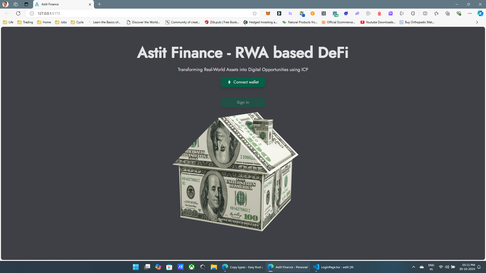
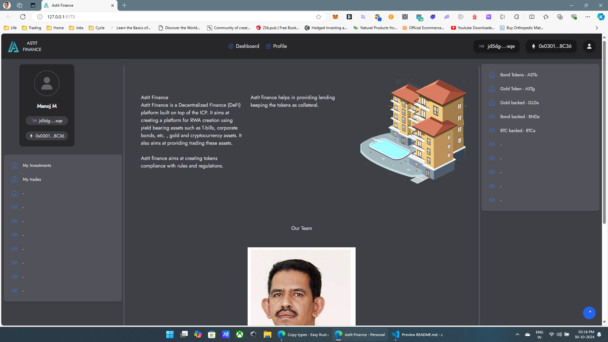
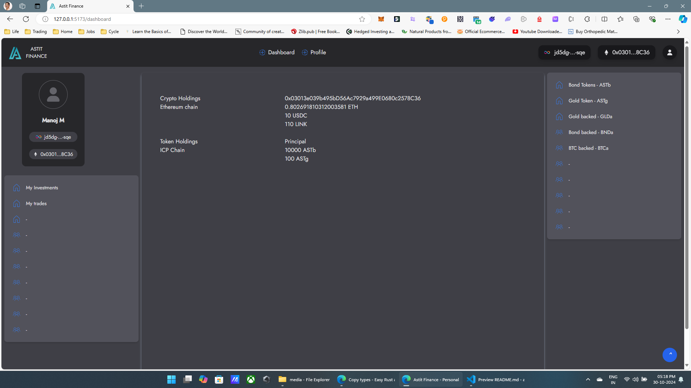
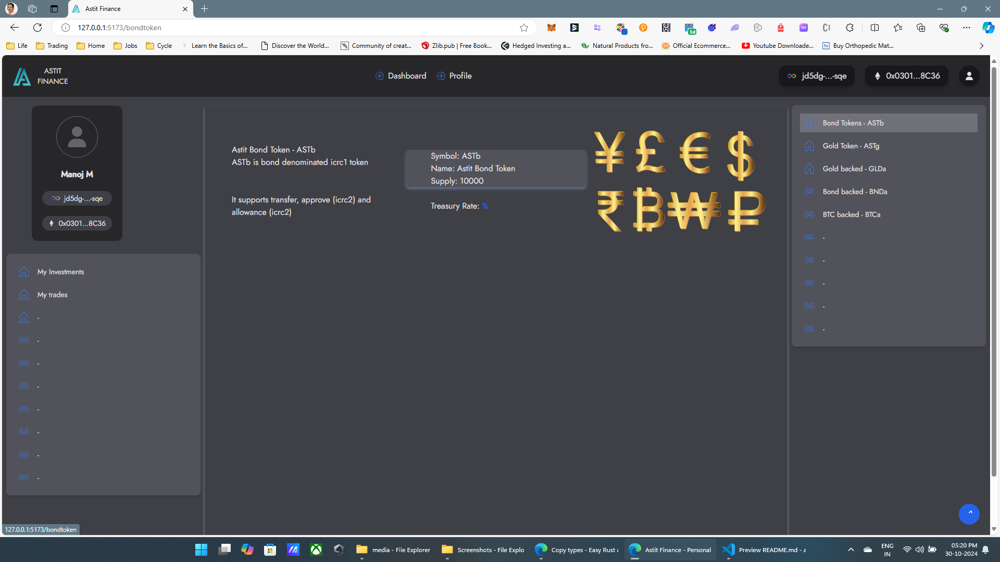
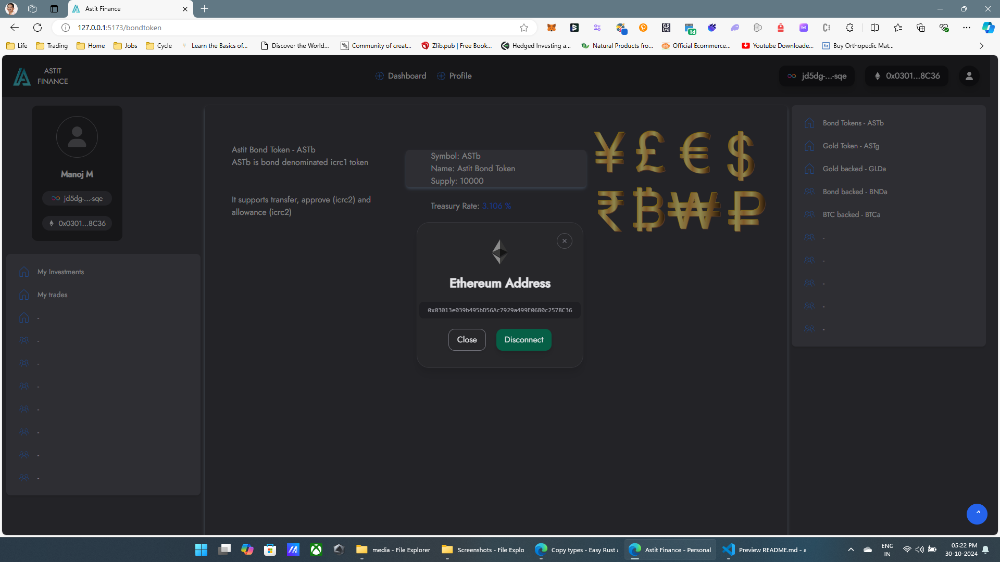

> [!NOTE]  
> This is bootstrapped using SIWE template available at "https://github.com/kristoferlund/ic-siwe-react-demo-rust"

✅ Sign in with Ethereum to interact with smart contracts (canisters) on the [Internet Computer](https://internetcomputer.org) (IC)!

✅ Establish a one-to-one relationship between an Ethereum wallet and an IC identity.

✅ Access the IC capabilities from Ethereum dapp frontends, create cross-chain dapps! Some of the features IC provide are:

- Native integration with BTC and ETH


- This application uses creating icrc1 tokens and http outcalls.
- Work is going on for creating icrc7 token creation using http outcalls and intercanister calls.


## Try the live demo: https://shtr2-2iaaa-aaaal-qckva-cai.icp0.io

## Key features

The demo uses:
- Rust for smart contract
- TypeScript
- TailwindCSS
- Wagmi/Viem Ethereum libraries
- RainbowKit for Ethereum wallet integration

## Table of contents

- [Key features](#key-features)
- [Table of contents](#table-of-contents)
- [App components](#app-components)
  - [Backend](#backend)
  - [Frontend](#frontend)
  - [IC SIWE Provider](#ic-siwe-provider)
  - [Rust canister](#ic-siwe-provider)
- [How it works](#how-it-works)
- [Run locally](#run-locally)
- [Details](#details)
  - [IC SIWE Provider](#ic-siwe-provider-1)
  - [Backend](#backend-1)
  - [Frontend](#frontend-1)
    - [SiweIdentityProvider](#siweidentityprovider)
    - [AuthGuard](#authguard)
    - [useSiweIdentity](#usesiweidentity)
- [License](#license)

## App components

### Backend

The backend is Rust based canisters which implements icrc1 token creation (Bondtoken and GoldToken), http outcalls and some basic functionality for managing user profiles.

### Frontend

The frontend is a React application that interacts with the backend canister. To be able to make authenticated calls to the backend canister, the frontend needs to have an identity.

### IC SIWE Provider

The pre-built IC Siwe Provider is used to create an identity for the user. It is a a Rust based canister that implements the SIWE login flow. The flow starts with a SIWE message being generated and ends with a Delegate Identity being created for the user. The Delegate Identity gives the user access to the backend canister.

## How it works

This is the high-level flow between the app components when a user logs in:

1. The application requests a SIWE message from the `ic_siwe_provider` canister on behalf of the user.
2. The application displays the SIWE message to the user who signs it with their Ethereum wallet.
3. The application sends the signed SIWE message to the `ic_siwe_provider` canister to login the user. The canister verifies the signature and creates an identity for the user.
4. The application retrieves the identity from the `ic_siwe_provider` canister.
5. The application can now use the identity to make authenticated calls to the app canister.
6. Two icrc1 token were created - Bondtoken - ASTb and Goldtoken - ASTg
7. http outcall procedures were used to fetch bond rate, gold rate and btc price.
8. These values along with intercanister calls will be made use in creating icrc7 tokens to create RWAs


## Run locally

```bash
dfx start --clean --background
make deploy-all
```

## Details

### IC SIWE Provider

The `ic_siwe_provider` canister is pre-built and added to the project as a dependency in the [dfx.json](/dfx.json) file.

```json
{
    "ic_siwe_provider": {
      "candid": "ic_siwe_provider.did",
      "type": "custom",
      "wasm": "ic_siwe_provider.wasm.gz"
    },
```

Its behavior is configured and passed as an argument to the canister `init` function. Below is an example of how to configure the canister using the `dfx` command line tool in the project [Makefile](/Makefile):

```makefile
deploy-provider:
	dfx deploy ic_siwe_provider --argument "( \
	    record { \
	        domain = \"127.0.0.1\"; \
	        uri = \"http://127.0.0.1:5173\"; \
	        salt = \"salt\"; \
	        chain_id = opt 11155111; \
	        scheme = opt \"http\"; \
	        statement = opt \"Login to the SIWE/IC\"; \
	        sign_in_expires_in = opt 300000000000; /* 5 minutes */ \
	        session_expires_in = opt 604800000000000; /* 1 week */ \
	        targets = opt vec { \
	            \"$$(dfx canister id ic_siwe_provider)\"; \
	            \"$$(dfx canister id backend)\"; \
	        }; \
	    } \
	)"
```
### Bondtoken

The `bondtoken` canister is pre-built and added to the project as a dependency in the [dfx.json](/dfx.json) file.

```json
    "bondtoken": {
      "candid": "icrc1_ledger.did",
      "type": "custom",
      "wasm": "icrc1-ledger.wasm.gz"
    },
```

Its behavior is configured and passed as an argument to the canister `init` function. Below is an example of how to configure the canister using the `dfx` command line tool in the project [Makefile](/Makefile):

```makefile
deploy-bondtoken:
	dfx deploy bondtoken --argument "(variant { Init = \
		record { \
			token_symbol = \"ASTb\"; \
			token_name = \"Astit Bond Token\"; \
			token_decimals = 2; \
			minting_account = record { owner = principal \"$$(dfx identity get-principal)\" }; \
			transfer_fee = 10_000; \
			metadata = vec {}; \
			initial_balances = vec { record { record { owner = principal \"$$(dfx identity get-principal)\"; }; 10_000; }; }; \
			archive_options = record { \
				num_blocks_to_archive = 1000; \
				trigger_threshold = 2000; \
				controller_id = principal \"$$(dfx identity get-principal)\"; \
			}; \
		} \
	})"
```

### Goldtoken

The `goldtoken` canister is pre-built and added to the project as a dependency in the [dfx.json](/dfx.json) file.

```json
    "goldtoken": {
      "candid": "icrc1_ledger.did",
      "type": "custom",
      "wasm": "icrc1-ledger.wasm.gz"
    },
```

Its behavior is configured and passed as an argument to the canister `init` function. Below is an example of how to configure the canister using the `dfx` command line tool in the project [Makefile](/Makefile):

```makefile
deploy-goldtoken:
	dfx deploy goldtoken --argument "(variant { Init = \
		record { \
			token_symbol = \"ASTg\"; \
			token_name = \"Astit Gold Token\"; \
			token_decimals = 4; \
			minting_account = record { owner = principal \"$$(dfx identity get-principal)\" }; \
			transfer_fee = 10_000; \
			metadata = vec {}; \
			initial_balances = vec { record { record { owner = principal \"$$(dfx identity get-principal)\"; }; 100; }; }; \
			archive_options = record { \
				num_blocks_to_archive = 1000; \
				trigger_threshold = 2000; \
				controller_id = principal \"$$(dfx identity get-principal)\"; \
			}; \
		} \
	})"
```
### Backend

#### [Bondrate](src/backend/src/treasury_rate.rs)
#### [Goldrate](src/backend/src/gold_rate.rs)
#### [BTCrate](src/backend/src/btc_rate.rs)

The canisters use http outcalls to get the data

The backend is Rust based canister that, for demonstration purposes, implements some basic functionality for managing user profiles. It is also given an init argument - the `ic_siwe_provider` canister id - to be able to verify the identity of the user.

```makefile
dfx deploy backend --argument "$$(dfx canister id ic_siwe_provider)"
```

### Frontend

The frontend is a React application that interacts with the backend canister. To be able to make authenticated calls to the backend canister, the frontend needs an identity. The identity is retrieved from the `ic_siwe_provider` canister.

The frontend uses two other packages from the `ic-siwe` project to simplify logging in users and making authenticated calls to canisters:

- [ic-use-siwe-identity](https://github.com/kristoferlund/ic-siwe/tree/main/packages/ic-use-siwe-identity) - React hook and context provider for easy frontend integration with SIWE enabled Internet Computer canisters.
- [ic-use-actor](https://github.com/kristoferlund/ic-use-actor) - A React context provider for managing Internet Computer (IC) actors with enhanced features like type safety and request/response interceptors.

#### [SiweIdentityProvider](src/frontend/src/main.tsx)

The application's root component is wrapped with `SiweIdentityProvider` to provide all child components access to the SIWE identity context.

```jsx
// main.tsx

import { SiweIdentityProvider } from 'ic-use-siwe-identity';
import { _SERVICE } from "../../declarations/ic_siwe_provider/ic_siwe_provider.did";

ReactDOM.createRoot(document.getElementById("root")!).render(
  <React.StrictMode>
    // ...
    <SiweIdentityProvider<_SERVICE>
      canisterId={canisterId}
      idlFactory={idlFactory}
    >
      // ... app components
    </SiweIdentityProvider>
    // ...
  </React.StrictMode>,
);
```

#### [AuthGuard](src/frontend/src/AuthGuard.tsx)

An `AuthGuard` component is used to protect routes that require the user to be logged in. It also makes sure to log out the user if they change ethereum wallet etc.

#### [useSiweIdentity](src/frontend/src/components/login/LoginButton.tsx)

To initiate the login flow, the `login` function is called on the Use the `useSiweIdentity` hook.

```jsx
// LoginButton.tsx

import { useSiweIdentity } from "ic-use-siwe-identity";

function LoginButton() {
  const { login, clear, identity, ... } = useSiweIdentity();
  // ...
}
```

## License

This project is licensed under the MIT License. See the LICENSE file for more details.

## Scrrenshots

### Login page


### Logged page


### Dashboard page


### Bondtoken page


### Logout page
